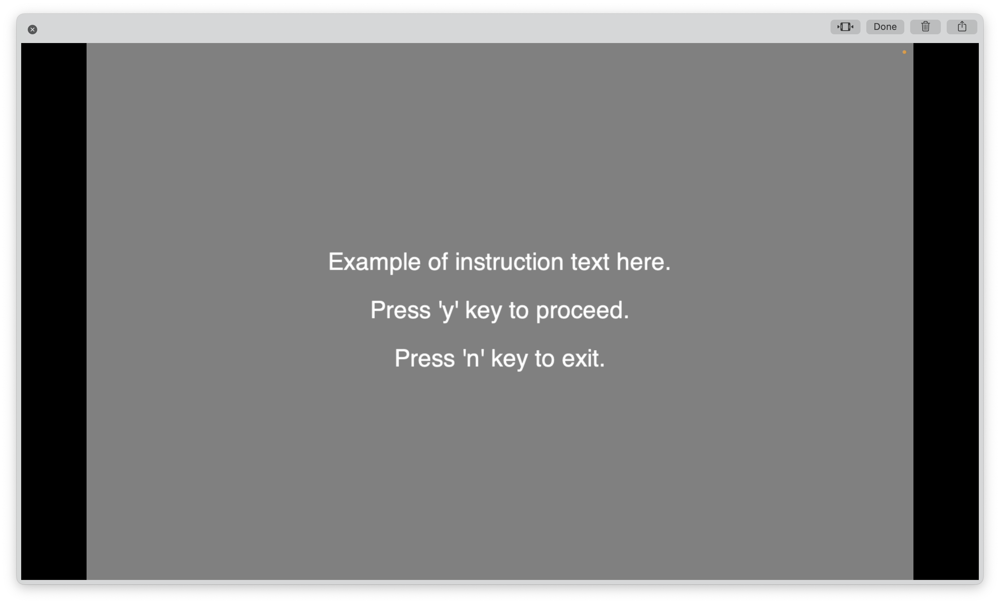

# psychopy_BasicExpSetting
This is an example of experiment setting, consisted of introduction, consent, stimuli (vignette-Likert), and ending routines.  

## How to Start
1. Download files in the same folder. 
2. If you want to work on the builder, run Psychopy and open 'intro-consent-text-slider.psyexp.' 
3. You can also work on '---.py' file if you are familiar to python code. 
  

## Procedure at a Glance

  

## Notes: Branch, Condition, Jump to the Last Routine  
#### Branch 
With loop function, different routines will be presented depending on the participants' answer to the previous routine. 
Please check the 'Code' element in each routines. 
#### Condition 
(1) With xlsX file, you can present the stimulus in randomized order. The xlsx file should be uploaded in the 'stimuliloop' window (Conditions section). 
(2) Stimulus are presented in random order (loopType = 'random'). 
#### Jump to the Last Routine 
Codes were added to skip 'consent' and/or 'stimuli' routine and directly go to the last ('bye') routine. 
